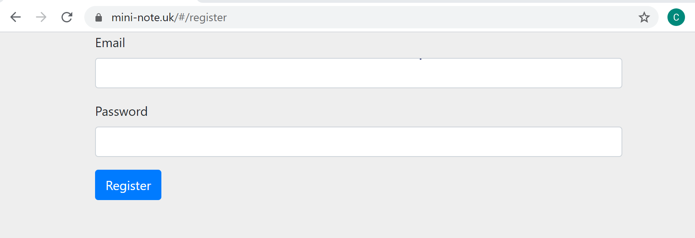
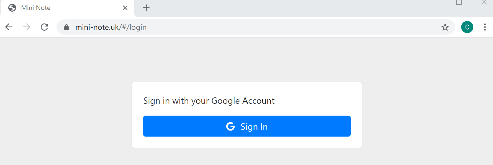
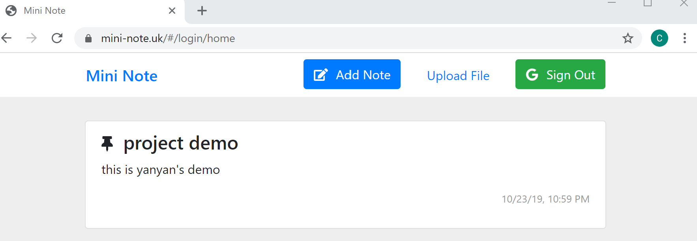
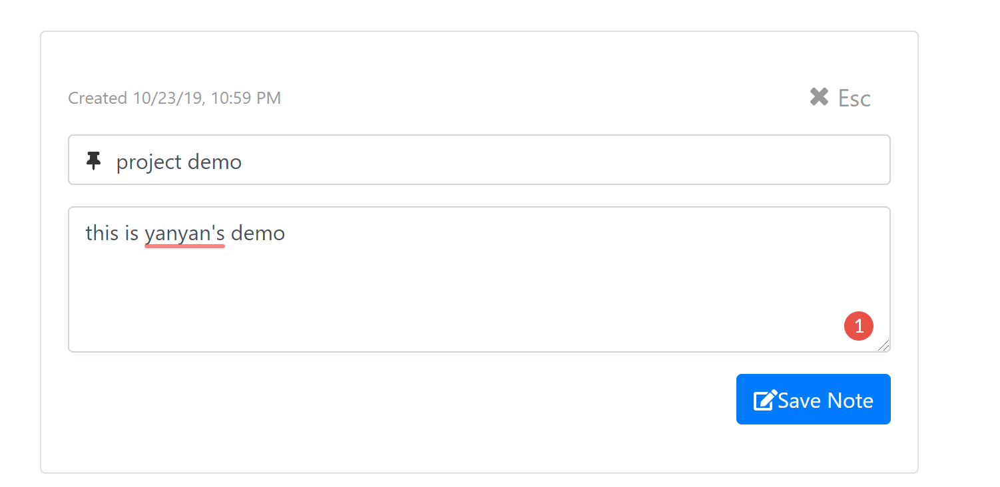
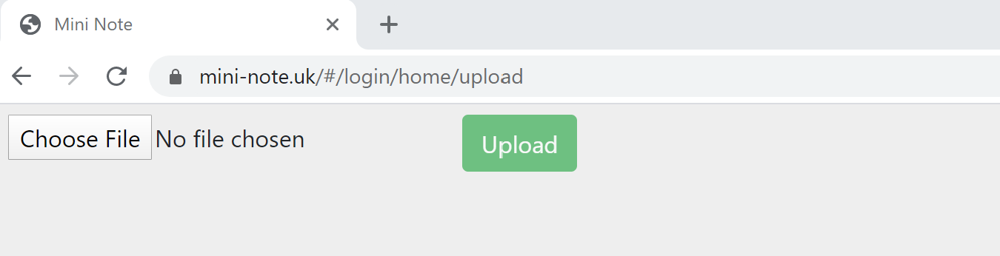

# Mini Note

**3-Tier Application Architecture**
- The presentation tier is built with Angular and hosted by an S3 bucket
- The business logic tier is built with Lambda function in Node.js.
- The database tier is built with AWS DynamoDB

**Project Introduction**:
* Angular is used to build client-side frontend application, and AWS services are used to build app backend.
* Used AWS services are as following:
  * AWS lambda for serverless,event driven code execution
  * AWS CloudFront to distribute app in order to minimize the latency and ease the traffic
  * AWS Route 53 for domain services
  * AWS IAM for access Control
  * AWS Congito to authenticate user
  * AWS S3 bucket to store frontend layer
  * AWS DynamoDB to store data
  * AWS CodeCommit, CodePipeLine for version control, auto deployment
  * AWS API Gateway for a secured API endpoint 


## Sample Demo Screenshots
### Email Sign up 


### Social Login 


### Notes Taking


### Notes Editing


### Notes Uploading



## Getting Started

These instructions will get you a copy of the project up and running on your local machine for development and testing purposes.

### Pre-Requisites Setup
You need **Node.js** prior to installing.
* Install Node.js
    * Install the latest [Node version](https://nodejs.org/en/download/) from
    the Node.js website for your proper OS.

### Running the Project Locally
With Node and Redux DevTools installed, clone this repository with
```
git clone https://github.com/goldfishyyy/MiniNote.git
```

* In Command Prompt:
    1. Go to file location in your machine: `cd MiniNOte`
    2. Install all dependencies with 
    ```
    npm install && cd back-end && npm install
    ```
    3. To run the program:
    * To first start the backend, enter the `back-end` folder and start the
    server with
    ```
    cd back-end && npm start
    ```
    * Then, in the `SmartPhotoCategorizer` folder, run
    ```
      npm run start
    ```
    * The application should open in the browser shortly after.

